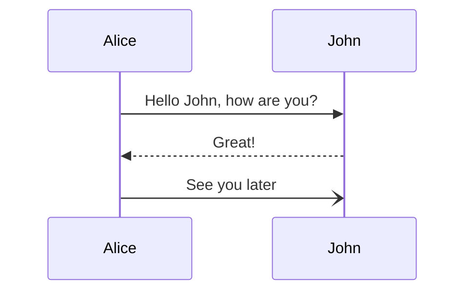

# revisao-prova-typescript

<h3 align="center">HTML</h3>


Isto é um parágrafo, bla bla bla<br>
adasddasd

```javascript

function teste(param1) {

}

```

```html

<h3>HTML</h3>

```


```bash
 echo "hello world"
```

